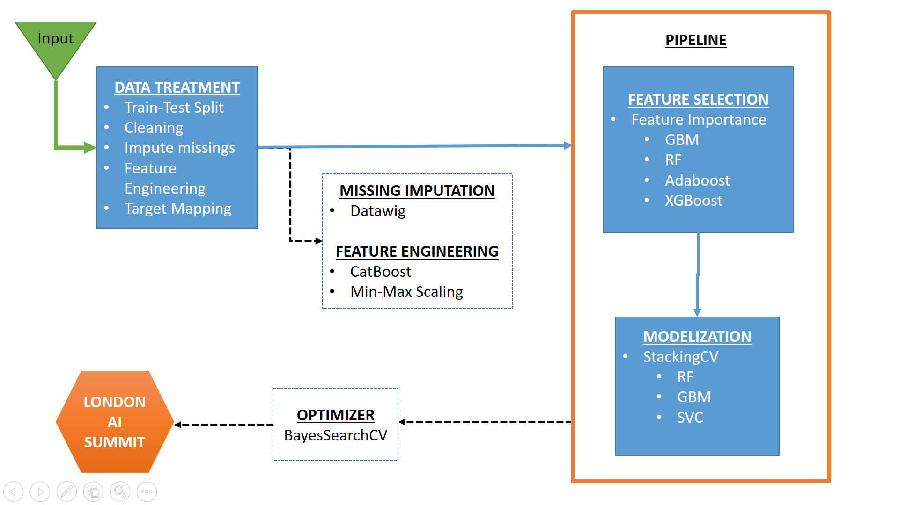

# Proceso AutoML con arquitectura Pipeline y optimización Bayesiana
Diseño de una herramienta de AutoML que cubre el flujo end-to-end de un proceso de modelización automatizada. En este ejercicio se incluye la carga de datos, el preprocesado, la selección de variables, el entrenamiento de modelos, la selección de modelos y la predicción. El reto está acotado para problemas de clasificación binaria en los que se valora el AUC como métrica de predicción a maximizar.

